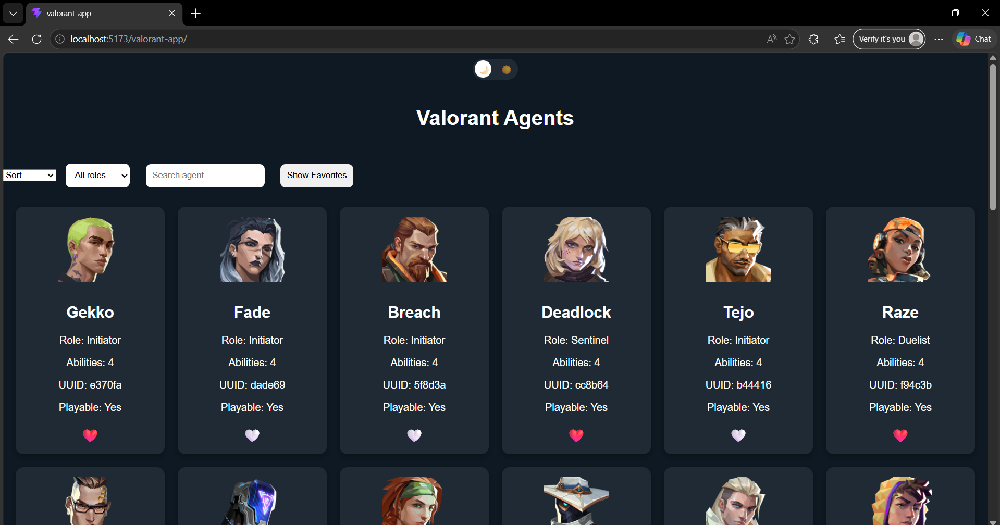
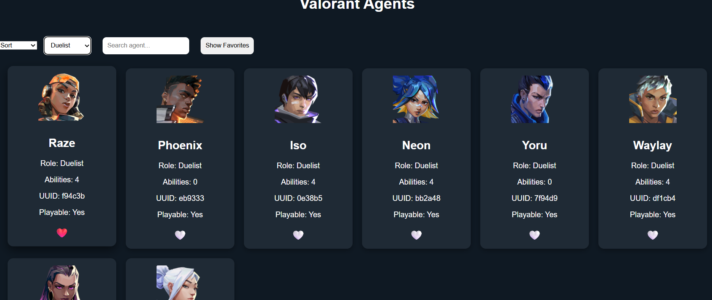
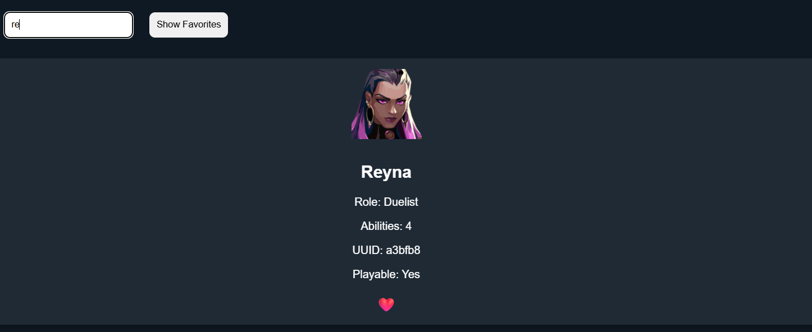
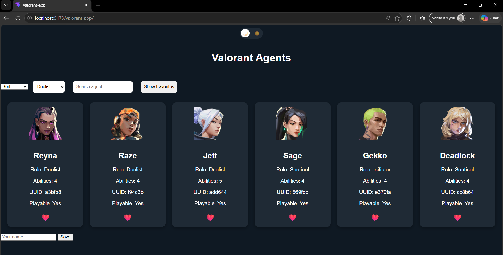
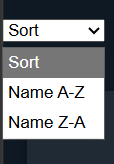
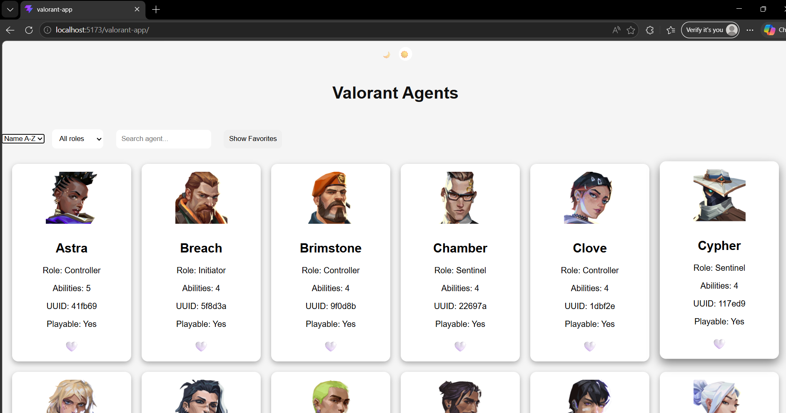
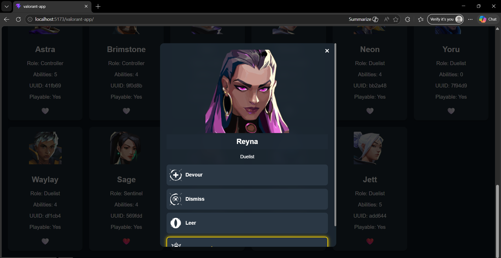
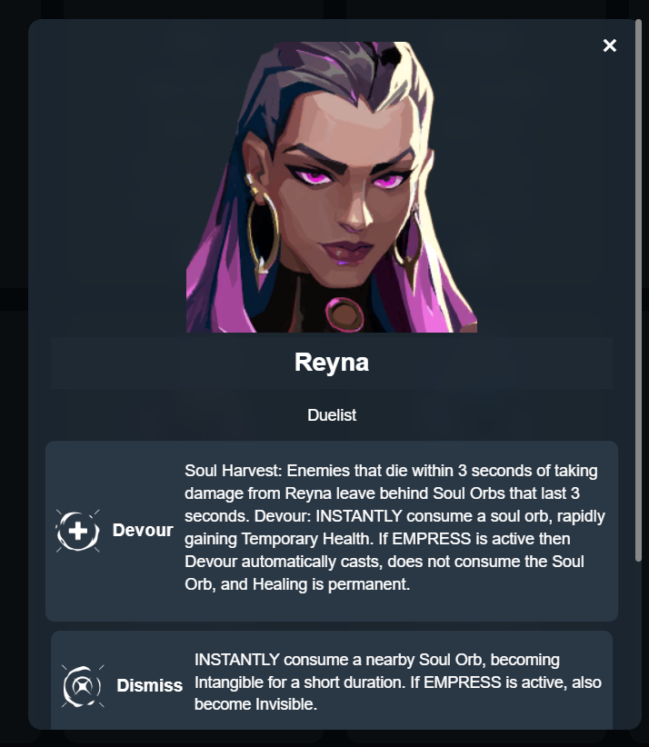

#  Valorant Agents App

##  Projectbeschrijving

Dit project is een interactieve webapplicatie gebouwd voor het vak Advanced Web.
De app gebruikt de Valorant API om agents te tonen en laat gebruikers deze filteren, zoeken, sorteren en opslaan als favorieten.

---

##  Live Demo

https://Sena-yz.github.io/valorant-app

---

##  Functionaliteiten

*  Zoekfunctie op naam
*  Filter op role (Duelist, Controller, etc.)
*  Sorteren (A-Z / Z-A)
*  Favorieten opslaan (LocalStorage)
*  Dark / Light mode
*  Popup met abilities van agents

---

## Technische vereisten

### DOM manipulatie

* querySelector
* innerHTML
* eventListeners

### Modern JavaScript

* const / let
* arrow functions
* template literals
* array methods (filter, sort, find, some)
* ternary operator

### API & Data

* fetch API
* async/await
* JSON verwerking

### Opslag

* LocalStorage (favorieten + username)

---

## 🛠️ Installatie

```bash
npm install
npm run dev
```

Build voor productie:

```bash
npm run build
```

---

##  Screenshots

###  Home



###  Filter




###  Favorites



###  Sort



###  Light Mode



###  Popup




---

##  Bronnen

* https://valorant-api.com
* https://vitejs.dev
* MDN Web Docs

---

##  AI Gebruik

Tijdens dit project werd ChatGPT gebruikt voor:

* debugging
* uitleg
* hulp bij deployment

---

##  Conclusie

Deze applicatie toont hoe een moderne webapp gebouwd wordt met JavaScript, API’s en Vite.


# TEST

werkt dit?